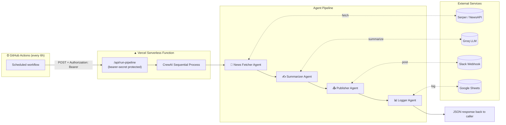

# 🗞️ AI News Bot

An autonomous multi-agent pipeline that fetches trending news, summarizes it with an LLM, posts it to Slack, and logs it to Google Sheets — running hands-free on a schedule, deployed serverless on Vercel.

       

---

## Overview

Four specialized CrewAI agents run in a sequential pipeline, each with exactly one custom tool:

| # | Agent | Tool | Job |
|---|-------|------|-----|
| 1 | News Fetcher | `NewsFetcherTool` | Pulls latest headlines per topic (Serper News API, falls back to NewsAPI.org) |
| 2 | Summarizer | `SummarizerTool` | Turns each article into a short, factual 2–3 sentence summary (Groq LLM) |
| 3 | Publisher | `SlackBotTool` | Posts headline + summary + link to a Slack channel via Incoming Webhook |
| 4 | Logger | `SheetsLoggerTool` | Records every published story to Google Sheets |

The whole thing runs behind a single Vercel serverless endpoint, triggered automatically every 6 hours.

## Architecture & Flow



**Why this shape:** Vercel's Hobby plan cron only fires once a day, so GitHub Actions stays as the free external scheduler — it just calls the deployed endpoint every 6 hours via `curl` instead of running the pipeline itself. Vercel does the actual work; GitHub only does the "wake up" call.

## Project Structure

```
ai-news-bot/
├── api/
│   └── run-pipeline.py        # Vercel serverless entrypoint (HTTP wrapper around crew.py)
├── tools/
│   ├── __init__.py
│   ├── news_fetcher_tool.py   # Serper / NewsAPI search
│   ├── summarizer_tool.py     # Groq summarization
│   ├── slack_tool.py          # Slack Incoming Webhook post
│   └── sheets_tool.py         # Google Sheets logging (gspread)
├── .github/
│   └── workflows/
│       └── run-pipeline.yml   # Cron: calls the Vercel endpoint every 6h
├── agents.py                  # 4 CrewAI agent definitions
├── tasks.py                   # 4 task definitions (fetch → summarize → publish → log)
├── crew.py                    # Builds & runs the sequential Crew
├── main.py                    # Local entrypoint (python main.py)
├── config.py                  # Central env-var reader
├── vercel.json                # Function memory/timeout config
├── requirements.txt
├── .env.example
└── README.md
```

## Environment Variables

Copy `.env.example` to `.env` and fill in each value. Here's where to get them:

| Variable | Required | Where to get it |
|---|---|---|
| `GROQ_API_KEY` | ✅ | [console.groq.com](https://console.groq.com/keys) → Create API key (free tier) |
| `LLM_MODEL` | Optional | Defaults to `groq/openai/gpt-oss-20b`; override to use a different Groq-hosted model |
| `SERPER_API_KEY` | One of these two | [serper.dev](https://serper.dev) → Sign up → Dashboard → API Key (free tier: 2,500 searches) |
| `NEWSAPI_API_KEY` | One of these two | [newsapi.org](https://newsapi.org/register) → free Developer plan |
| `SLACK_WEBHOOK_URL` | ✅ | Slack → [api.slack.com/apps](https://api.slack.com/apps) → Create App → Incoming Webhooks → Add New Webhook to Workspace → copy URL |
| `GOOGLE_SERVICE_ACCOUNT_JSON` | ✅ | [Google Cloud Console](https://console.cloud.google.com) → IAM & Admin → Service Accounts → Create → Keys → Add Key (JSON) → paste the **entire file contents as one line** |
| `GOOGLE_SHEET_ID` | ✅ | Open your target Google Sheet → copy the ID from the URL: `docs.google.com/spreadsheets/d/`**`THIS_PART`**`/edit` — then share the sheet with the service account's email (Editor access) |
| `NEWS_TOPICS` | ✅ | Comma-separated, e.g. `AI,tech,finance,crypto` |
| `MAX_PER_TOPIC` | Optional | Headlines fetched per topic (default `5`) |
| `RUN_SECRET` | ✅ (Vercel only) | Any long random string you generate yourself, e.g. `openssl rand -hex 32` — authenticates calls to `/api/run-pipeline` |

> Only **one** of `SERPER_API_KEY` / `NEWSAPI_API_KEY` is required — the fetcher tries Serper first and falls back to NewsAPI.

## Run It Locally

```bash
# 1. Clone the repo
git clone https://github.com/m-sameerkhan/ai-news-automation-bot.git
cd ai-news-automation-bot

# 2. Create a virtual environment
python -m venv venv
# Windows (PowerShell)
venv\Scripts\Activate.ps1
# macOS/Linux
source venv/bin/activate

# 3. Install dependencies
pip install -r requirements.txt

# 4. Configure environment variables
cp .env.example .env
# now open .env and fill in every key from the table above

# 5. Run the pipeline once
python main.py
```

You should see verbose CrewAI logs as each agent runs, then a summary printed to console, a message posted in your Slack channel, and a new row in your Google Sheet.

## Deploy on Vercel

1. Push this repo to GitHub.
2. [vercel.com](https://vercel.com) → **New Project** → import the repo. Vercel auto-detects the Python function in `api/`.
3. Project Settings → **Environment Variables** → add every variable from the table above (including `RUN_SECRET`).
4. Deploy. Note your app URL, e.g. `https://ai-news-bot.vercel.app`.
5. Test the endpoint manually:
   ```bash
   curl -X POST https://ai-news-bot.vercel.app/api/run-pipeline \
     -H "Authorization: Bearer <your RUN_SECRET>"
   ```
   A `200` response with `"status": "ok"` means the full pipeline just ran end-to-end on Vercel.

`vercel.json` sets the function to 300s timeout / 2GB memory — the maximum Vercel's Hobby plan allows, since a 4-agent run doing live API calls can take a while.

## Automation (Scheduling)

GitHub Actions triggers the deployed endpoint every 6 hours — add these two repo secrets under **Settings → Secrets and variables → Actions**:

| Secret | Value |
|---|---|
| `VERCEL_APP_URL` | Your deployed URL, e.g. `https://ai-news-bot.vercel.app` |
| `RUN_SECRET` | The same value you set in Vercel |

The workflow (`.github/workflows/run-pipeline.yml`) runs on the cron schedule `0 */6 * * *`, or trigger it manually anytime from the **Actions** tab (`workflow_dispatch`).

## Notes & Troubleshooting

- **Bundle size**: CrewAI's dependency tree is sizable. If Vercel's deploy fails on the 500MB uncompressed limit for Python functions, trim `requirements.txt` to what you actually use, or enable **Large functions** (up to 5GB) in Vercel project settings.
- **Timeouts**: If runs are timing out, lower `MAX_PER_TOPIC` or the number of `NEWS_TOPICS` to shorten each run.
- **401 from the endpoint**: means `RUN_SECRET` doesn't match between GitHub Actions and Vercel — check both are set to the exact same value.