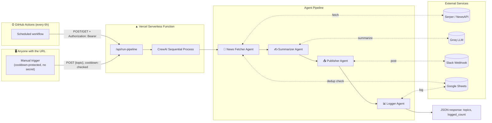

# 🗞️ AI News Bot

An autonomous multi-agent pipeline that fetches trending news, summarizes it with an LLM, posts it to Slack, and logs it to Google Sheets — running hands-free on a schedule, deployed serverless on Vercel. Includes a live dashboard for browsing logged stories and triggering ad-hoc runs for any topic.

       

---

## Overview

Four specialized CrewAI agents run in a sequential pipeline, each with exactly one custom tool:

|  | Agent | Tool | Job |
|---|-------|------|-----|
| 1 | News Fetcher | `NewsFetcherTool` | Pulls latest headlines per topic (Serper News API, falls back to NewsAPI.org), filtering out anything already logged to the Sheet within the dedup window |
| 2 | Summarizer | `SummarizerTool` | Turns each article into a short, factual 2–3 sentence summary (Groq LLM) |
| 3 | Publisher | `SlackBotTool` | Posts headline + summary + link to a Slack channel via Incoming Webhook |
| 4 | Logger | `SheetsLoggerTool` | Records every published story to Google Sheets |

The whole thing runs behind a single Vercel serverless endpoint (`api/run-pipeline.py`), which does triple duty: it serves a browsable dashboard, runs the pipeline on a schedule via GitHub Actions, and lets anyone trigger an ad-hoc run for a specific topic straight from the dashboard.

## Duplicate Protection

Before an article ever reaches the Summarizer, `NewsFetcherTool` checks its headline (normalized — lowercased, punctuation stripped, whitespace collapsed) against every headline logged to the Sheet within the last `DEDUP_WINDOW_HOURS` (default 48h). Matches are dropped silently, so a story already covered doesn't get re-summarized, re-posted to Slack, or re-logged — even across multiple scheduler runs on the same day.

Headline comparison is used instead of source URL, since aggregator links (e.g. Google News redirect URLs) can encode a different token per fetch even when the underlying story is identical — a URL-based check would miss real duplicates and let them through.

`SheetsLoggerTool` also carries its own duplicate check as a final safety net, in case an article somehow reaches the logging step despite the earlier filter.

## Dashboard

Visiting the deployed URL (or `localhost` when running locally) serves a dark-themed console with:

- **A live news feed** — every story ever logged to the Sheet, filterable by topic pill and searchable by headline/summary, refreshed via `?feed=json`.
- **A manual trigger** — type any topic (or leave it blank to use the configured `NEWS_TOPICS` defaults) and click **Get News** to run the pipeline immediately for just that topic. No secret or login required.
- **Cooldown protection** — the manual trigger has no auth gate, so it's protected instead by a short server-side cooldown checked against the timestamp of the most recently logged story (default 5 minutes, see `RUN_COOLDOWN_SECONDS` below). Clicking again before the cooldown expires returns a `429` with the remaining wait time, shown inline rather than as an error.
- **An honest run log** — after a manual run, the dashboard reports how many stories were actually verified as newly logged in the Sheet (`logged_count`), not just whether the HTTP call returned `200`. A `200` with zero newly-logged stories (e.g. no fresh headlines, or everything found was a duplicate) is shown as a distinct outcome from a real failure.

The scheduled cron runs (GitHub Actions / Vercel's own cron) are unaffected by any of this — they still authenticate with `RUN_SECRET` / `CRON_SECRET` as before and always use the default `NEWS_TOPICS` list.

## Architecture & Flow



**Why this shape:** Vercel's Hobby plan cron only fires once a day, so GitHub Actions stays as the free external scheduler — it just calls the deployed endpoint every 6 hours via `curl` instead of running the pipeline itself. Vercel does the actual work; GitHub only does the "wake up" call. The dashboard's manual trigger reuses the exact same `/api/run-pipeline` endpoint and pipeline code, just with a topic override and a cooldown instead of a secret.

Duplicate filtering happens inside `NewsFetcherTool` itself (deterministic code, not an LLM decision), so it runs identically no matter which trigger path — cron or manual — kicked off the run.

## Project Structure

```
ai-news-bot/
├── api/
│   ├── run-pipeline.py        # Vercel serverless entrypoint (HTTP wrapper around crew.py)
│   ├── dashboard_html.py      # Dashboard page skeleton; assembles HTML + CSS + JS -> get_dashboard_html()
│   ├── dashboard_css.py       # Dashboard styles, as a plain Python string (DASHBOARD_CSS)
│   └── dashboard_js.py        # Dashboard client-side behavior, as a plain Python string (DASHBOARD_JS)
├── tools/
│   ├── __init__.py
│   ├── news_fetcher_tool.py   # Serper / NewsAPI search + headline-based dedup filtering
│   ├── summarizer_tool.py     # Groq summarization
│   ├── slack_tool.py          # Slack Incoming Webhook post
│   └── sheets_tool.py         # Google Sheets logging (gspread) + read_recent_stories() for the feed/cooldown + get_recent_headlines() for dedup
├── .github/
│   └── workflows/
│       └── run-pipeline.yml   # Cron: calls the Vercel endpoint every 6h
├── agents.py                  # 4 CrewAI agent definitions
├── tasks.py                   # 4 task definitions (fetch → summarize → publish → log)
├── crew.py                    # Builds & runs the sequential Crew; accepts a topics override
├── main.py                    # Local entrypoint (python main.py) — runs the default topics once
├── local_dev_server.py        # Runs the dashboard/pipeline handler on stdlib HTTPServer, no Vercel CLI needed
├── config.py                  # Central env-var reader
├── vercel.json                # Function memory/timeout config, crons, and root-path rewrite to the dashboard
├── requirements.txt
├── .env.example
└── README.md
```

> **Why `dashboard_*.py` and not a plain `.html` file:** Vercel's Python runtime serves this dashboard as a string returned from a serverless function, not a static asset. Splitting CSS/JS into their own plain (non-f-string) Python modules keeps the hundreds of literal `{`/`}` characters in the CSS and the `${...}` template literals in the JS from being misparsed as Python f-string interpolations — which is exactly what breaks if you paste raw HTML/CSS/JS directly into an f-string.

## Environment Variables

Copy `.env.example` to `.env` and fill in each value. Here's where to get them:

| Variable | Required | Where to get it |
|---|---|---|
| `GROQ_API_KEY` | ✅ | [console.groq.com](https://console.groq.com/keys) → Create API key (free tier) |
| `LLM_MODEL` | Optional | Defaults to `groq/openai/gpt-oss-20b`; override to use a different Groq-hosted model |
| `SERPER_API_KEY` | One of these two | [serper.dev](https://serper.dev) → Sign up → Dashboard → API Key (free tier: 2,500 searches) |
| `NEWSAPI_API_KEY` | One of these two | [newsapi.org](https://newsapi.org/register) → free Developer plan |
| `SLACK_WEBHOOK_URL` | ✅ | Slack → [api.slack.com/apps](https://api.slack.com/apps) → Create App → Incoming Webhooks → Add New Webhook to Workspace → copy URL |
| `GOOGLE_SERVICE_ACCOUNT_JSON` | ✅ (or the path below) | [Google Cloud Console](https://console.cloud.google.com) → IAM & Admin → Service Accounts → Create → Keys → Add Key (JSON) → paste the **entire file contents as one line** |
| `GOOGLE_SERVICE_ACCOUNT_PATH` | ✅ (or the JSON above) | Local/dev-friendly alternative to `GOOGLE_SERVICE_ACCOUNT_JSON` — a filesystem path to the same service account key file |
| `GOOGLE_SHEET_ID` | ✅ | Open your target Google Sheet → copy the ID from the URL: `docs.google.com/spreadsheets/d/`**`THIS_PART`**`/edit` — then share the sheet with the service account's email (Editor access) |
| `NEWS_TOPICS` | ✅ | Comma-separated default topics for scheduled runs, e.g. `AI,finance,space,biotech`. The dashboard's manual trigger can override this per-request; leaving the box blank falls back to this list. |
| `MAX_PER_TOPIC` | Optional | Headlines fetched per topic (default `1`) |
| `MAX_RPM` | Optional | Max LLM requests/minute per agent, to stay under Groq's TPM rate limits (default `3`) |
| `SUMMARY_DELAY_SECONDS` | Optional | Seconds to sleep between `SummarizerTool` calls to spread out token usage (default `5`) |
| `DEDUP_WINDOW_HOURS` | Optional | How far back (in hours) to check for duplicate headlines before fetching new articles (default `48`) |
| `RUN_SECRET` | ✅ (Vercel only) | Any long random string you generate yourself, e.g. `openssl rand -hex 32` — authenticates the **scheduled/cron** GET calls to `/api/run-pipeline`. Not needed for the dashboard's manual trigger. |
| `CRON_SECRET` | Optional | Automatically sent by Vercel's own built-in cron as a Bearer token when this env var is set — an alternative to `RUN_SECRET` for Vercel's daily Hobby-plan cron specifically (see `vercel.json`). |
| `RUN_COOLDOWN_SECONDS` | Optional | How long the dashboard's manual trigger stays cooled down after the last logged story, so repeated clicks can't burn through API quota (default `300`, i.e. 5 minutes) |
| `MAX_TOPICS` | Optional | Hard cap on how many comma-separated topics one manual dashboard request can pass, since each topic is a separate Serper/NewsAPI call (default `5`) |

> Only **one** of `SERPER_API_KEY` / `NEWSAPI_API_KEY` is required — the fetcher tries Serper first and falls back to NewsAPI. Same for `GOOGLE_SERVICE_ACCOUNT_JSON` vs `GOOGLE_SERVICE_ACCOUNT_PATH` — only one is needed, whichever fits your environment (JSON contents for CI/serverless, a file path for local dev).

## Run It Locally

```bash
# 1. Clone the repo
git clone https://github.com/m-sameerkhan/ai-news-automation-bot.git
cd ai-news-automation-bot

# 2. Create a virtual environment
python -m venv venv
# Windows (PowerShell)
venv\Scripts\Activate.ps1
# macOS/Linux
source venv/bin/activate

# 3. Install dependencies
pip install -r requirements.txt
pip install python-dotenv   # only needed for local_dev_server.py's .env loading

# 4. Configure environment variables
cp .env.example .env
# now open .env and fill in every key from the table above
```

From here, pick whichever fits what you're testing:

**Option A — just run the pipeline once, no server:**
```bash
python main.py
```
Runs against your default `NEWS_TOPICS`, prints verbose CrewAI logs, posts to Slack, logs a row to the Sheet.

**Option B — run the dashboard + endpoint locally, fastest loop:**
```bash
python local_dev_server.py
```
Serves the full dashboard (feed, search, topic pills, manual trigger) at `http://localhost:8000` using Python's stdlib `HTTPServer` directly — no Vercel CLI install needed. Good for iterating on the dashboard UI or testing the manual-trigger/cooldown flow. Note: this doesn't apply `vercel.json` routing and Vercel's automatic `CRON_SECRET` header won't be sent, so it's not a substitute for testing the actual cron path. Also remember `config.py` reads `.env` once at process start — restart this server after any `.env` change.

**Option C — production-accurate, via the Vercel CLI:**
```bash
npm i -g vercel
vercel link      # first time only
vercel dev
```
Applies the same routing and env handling Vercel uses in production. Use this if you need to test the `?format=json` / cron-authenticated path specifically.

## Deploy on Vercel

1. Push this repo to GitHub.
2. [vercel.com](https://vercel.com) → **New Project** → import the repo. Vercel auto-detects the Python function in `api/`.
3. Project Settings → **Environment Variables** → add every variable from the table above (including `RUN_SECRET`).
4. Deploy. Note your app URL, e.g. `https://ai-news-bot.vercel.app`.
5. Open the URL in a browser — you should see the dashboard, with the feed empty until the first run logs something.
6. Test the scheduled/cron path manually:
   ```bash
   curl "https://ai-news-bot.vercel.app/api/run-pipeline?format=json" \
     -H "Authorization: Bearer <your RUN_SECRET>"
   ```
   A `200` response with `"status": "ok"` means the full pipeline just ran end-to-end on Vercel using your default `NEWS_TOPICS`.
7. Or just click **Get News** on the dashboard itself — no secret needed, only the cooldown applies.

`vercel.json` sets the function to 300s timeout / 2GB memory — the maximum Vercel's Hobby plan allows, since a 4-agent run doing live API calls can take a while. It also rewrites the root path (`/`) to `/api/run-pipeline` so the dashboard loads at the bare domain, not just at `/api/run-pipeline` directly.

## Automation (Scheduling)

GitHub Actions triggers the deployed endpoint every 6 hours — add these two repo secrets under **Settings → Secrets and variables → Actions**:

| Secret | Value |
|---|---|
| `VERCEL_APP_URL` | Your deployed URL, e.g. `https://ai-news-bot.vercel.app` |
| `RUN_SECRET` | The same value you set in Vercel |

The workflow (`.github/workflows/run-pipeline.yml`) runs on the cron schedule `0 */6 * * *`, or trigger it manually anytime from the **Actions** tab (`workflow_dispatch`). This scheduled path always uses your `.env`-configured `NEWS_TOPICS` — it's separate from the dashboard's per-request topic override.

Vercel's own Hobby-plan cron also fires once daily (`0 8 * * *`, see `vercel.json`) as a second, independent trigger — both schedulers call the same endpoint and share the same underlying API quotas, but since duplicate protection now runs on every fetch regardless of trigger source, overlapping runs never produce duplicate Slack posts or Sheet rows. Worst case is a wasted fetch/summarize call if nothing new exists in that window.

## Notes & Troubleshooting

- **Bundle size**: CrewAI's dependency tree is sizable. If Vercel's deploy fails on the 500MB uncompressed limit for Python functions, trim `requirements.txt` to what you actually use, or enable **Large functions** (up to 5GB) in Vercel project settings.
- **Timeouts**: If runs are timing out, lower `MAX_PER_TOPIC` or the number of `NEWS_TOPICS` to shorten each run.
- **401 from the `?format=json` / cron path**: means `RUN_SECRET` (or `CRON_SECRET`) doesn't match between the caller and Vercel — check both are set to the exact same value. The dashboard's manual trigger doesn't need a secret at all, so a 401 there would indicate something else is wrong.
- **429 from the manual trigger**: expected behavior, not a bug — it means the cooldown (`RUN_COOLDOWN_SECONDS`) hasn't elapsed since the last logged story. The dashboard shows the remaining wait time inline.
- **Manual run reports `logged_count: 0`**: not necessarily a bug — it means either (a) Serper/NewsAPI genuinely has no fresh headlines for that topic right now, or (b) every headline found was already logged within `DEDUP_WINDOW_HOURS` and got filtered out before summarization ever ran. Check the response's `"topics"` field to confirm what was searched, and try a topic you haven't tested recently to distinguish the two cases. The Slack channel / terminal's verbose CrewAI output can also confirm whether the Publisher or Logger agent failed silently instead.
- **Old topic pills won't go away on the dashboard**: the feed and its topic pills are built from every row ever logged in the Sheet — changing `NEWS_TOPICS` only affects future runs, it doesn't relabel or remove historical rows. Clear old rows manually in the Sheet if you want a clean slate.
- **`.env` changes not taking effect**: `config.py` reads environment variables once at process start. Restart `local_dev_server.py` / `python main.py` after any `.env` edit — there's no live reload.